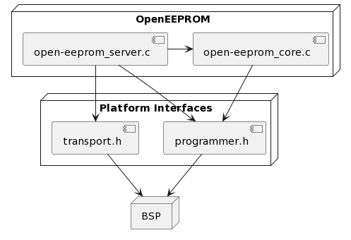

# OpenEEPROM Portable Programmer 

This project is the firmware component to OpenEEPROM. It contains a portable implementation of the OpenEEPROM protocol. The code 
can be ported to new platforms by implementing the interfaces defined in `programmer.h` and `transport.h`.
These files are located in `inc/open-eeprom/`. See `src/platforms/platform_tm4c.c` for an implementation.

## Project structure 

- Doxygen documentation is in `docs` (must run `make docs` first).
- Code specific to OpenEEPROM is found inside `{inc,src}/open-eeprom/`.
- Platform-specific code is in `{inc,src}/platforms`.
- Any other sources (e.g. `main`, application specific, code) are located in `src/app/`.
- `contrib/` contains third-party code (like BSPs).

## Compilation

The project is configured for compilation using `gcc`. The makefile is tailored to the TM4C platform, 
but with a few changes--mainly compilation flags--the code can be compiled for other platforms as well. Just leave out `platform_tm4c.c`
and include your own implementation for a different platform. The makefile includes the following recipes:

1. `all`: build both an ELF and a flat binary.

2. `docs`: generate Doxygen API documentation.

3. `clean`: delete build artifacts.

4. `flash`: flash the target with the latest build (TM4C only, uses [lm4flash](https://github.com/utzig/lm4tools.git)).

## Debugging
The repo includes a script `debug.sh` for debugging the target using `arm-none-eabi-gdb`. It requires 
[OpenOCD](https://github.com/openocd-org/openocd.git).

